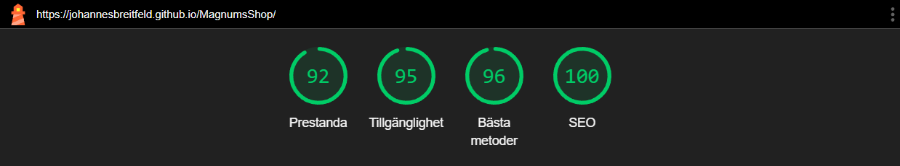
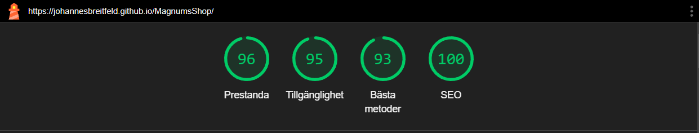
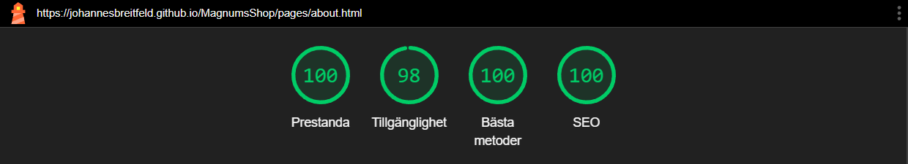
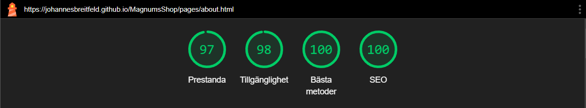
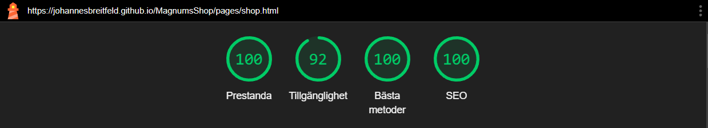
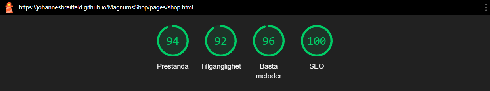

# MagnumsShop - First assignment Webbutveckling
Github pages deployment:
[https://johannesbreitfeld.github.io/MagnumsShop/](https://johannesbreitfeld.github.io/MagnumsShop/)
   
## Assignment
The assignment was to create a simple webshop and was given with the following directions:

- The webshop should consist of three pages: a landing page, an about page, and a services/shop page.
- Some kind of shoppingcart should be included.
- The webshop should include at least three HTML files and three CSS files.
- At least two fonts should be used.
- At least three colors, excluding black and white, should be used.
- A CSS library, such as Bootstrap, should be used.
- The about page should include a Google Maps module.
- An open API should be used to retrieve information.
- All products/services should be expandable in e.g., a modal for detailed information.
- The webpage should achieve a Lighthouse score of at least 90% for both desktop and mobile.

## Lighthouse scores
### Landing page (index.html)
Desktop:

Mobile:

### About (about.html)
Desktop:

Mobile:

### Shop (shop.html)
Desktop:

Mobile:

## API
I have used the RandomUser.me open API to retrieve the name, phone number, and picture for the employee cards on the about page.